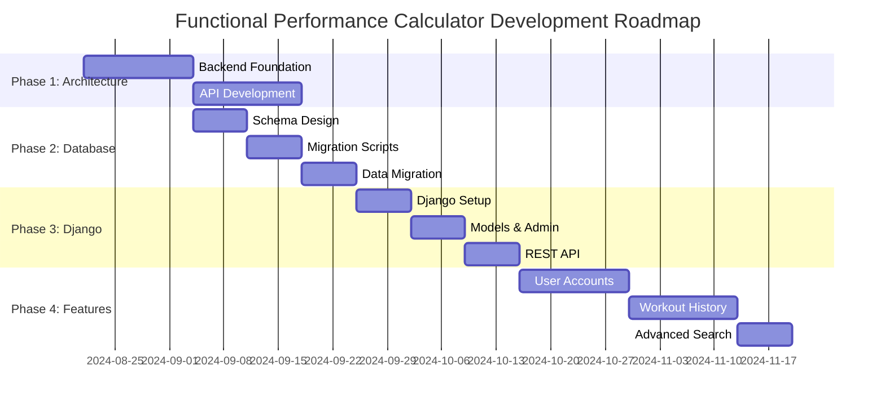

# Functional Performance Calculator - Development Roadmap

[](https://github.com/griffinsteffy19/functional-performance-calc/projects)
[](https://github.com/griffinsteffy19/functional-performance-calc/issues)
[](https://github.com/griffinsteffy19/functional-performance-calc/milestones)

> **Last Updated**: 2025-08-20  
> **Current Version**: v1.2.0  
> **Next Major Release**: v2.0.0 (Frontend/Backend Separation)

## Table of Contents
- [Current Status](#current-status)
- [Roadmap Overview](#roadmap-overview)
- [Phase 1: Architecture Foundation](#phase-1-architecture-foundation)
- [Phase 2: Database Migration](#phase-2-database-migration)
- [Phase 3: Django Backend](#phase-3-django-backend)
- [Phase 4: Enhanced Features](#phase-4-enhanced-features)
- [Phase 5: Platform Expansion](#phase-5-platform-expansion)
- [Feature Requests](#feature-requests)
- [Contributing](#contributing)
- [GitHub Integration](#github-integration)

## Current Status

### ✅ Completed (v1.2.0)
- [x] Live workout editor with variety selection
- [x] Automatic time calculation with manual override
- [x] Movement count loading fixes
- [x] Integer display for final scores
- [x] Improved UI with descriptive sidebar
- [x] Tab-based movement input
- [x] .VERSION file system with release scripts
- [x] Random workout selection
- [x] Comprehensive documentation

### 🚧 In Progress
- [ ] Frontend/Backend architecture separation
- [ ] Database design and migration planning

### 📋 Next Up
- [ ] Backend API development
- [ ] Database implementation
- [ ] Django backend setup

## Roadmap Overview



## Phase 1: Architecture Foundation
**Timeline**: Weeks 1-2 (Aug 21 - Sep 3, 2024)  
**GitHub Milestone**: [v2.0.0-alpha](https://github.com/griffinsteffy19/functional-performance-calc/milestone/1)

### Goals
- [ ] Separate frontend and backend concerns
- [ ] Create clean API layer
- [ ] Implement service-based architecture
- [ ] Maintain all existing functionality

### Key Features
- [ ] **Backend API** (`backend/api.py`)
  - [ ] Workout library operations
  - [ ] Movement database access
  - [ ] Calculation services
  - [ ] Data validation

- [ ] **Service Layer** (`backend/services/`)
  - [ ] Workout service for CRUD operations
  - [ ] Movement service for database access
  - [ ] Calculation service wrapper
  - [ ] Data service abstraction

- [ ] **Frontend Components** (`frontend/components/`)
  - [ ] Workout library UI component
  - [ ] Movement library UI component
  - [ ] Manual entry UI component
  - [ ] Results display component

### Success Criteria
- [ ] All existing features work through API
- [ ] Clean separation between UI and business logic
- [ ] Comprehensive test coverage (>90%)
- [ ] Performance maintained or improved

### GitHub Issues
- [#XX: Backend API Implementation](https://github.com/griffinsteffy19/functional-performance-calc/issues/XX)
- [#XX: Frontend Component Extraction](https://github.com/griffinsteffy19/functional-performance-calc/issues/XX)
- [#XX: Service Layer Development](https://github.com/griffinsteffy19/functional-performance-calc/issues/XX)

## Phase 2: Database Migration
**Timeline**: Weeks 3-4 (Sep 4 - Sep 17, 2024)  
**GitHub Milestone**: [v2.0.0-beta](https://github.com/griffinsteffy19/functional-performance-calc/milestone/2)

### Goals
- [ ] Convert JSON files to relational database
- [ ] Implement proper data relationships
- [ ] Add data integrity constraints
- [ ] Optimize query performance

### Key Features
- [ ] **Database Schema**
  - [ ] Categories table for workouts/movements
  - [ ] Movements table with varieties
  - [ ] Workouts table with relationships
  - [ ] Performance indexes

- [ ] **Migration System**
  - [ ] JSON-to-database migration scripts
  - [ ] Data validation and integrity checks
  - [ ] Rollback capabilities
  - [ ] Migration testing

- [ ] **Enhanced Queries**
  - [ ] Search workouts by movement
  - [ ] Filter by workout type and time
  - [ ] Advanced movement filtering
  - [ ] Performance optimization

### Success Criteria
- [ ] All JSON data successfully migrated
- [ ] Query performance <100ms
- [ ] Data integrity maintained
- [ ] Full backward compatibility

### GitHub Issues
- [#XX: Database Schema Design](https://github.com/griffinsteffy19/functional-performance-calc/issues/XX)
- [#XX: Migration Script Development](https://github.com/griffinsteffy19/functional-performance-calc/issues/XX)
- [#XX: Data Validation System](https://github.com/griffinsteffy19/functional-performance-calc/issues/XX)

## Phase 3: Django Backend
**Timeline**: Weeks 5-6 (Sep 18 - Oct 1, 2024)  
**GitHub Milestone**: [v3.0.0-rc](https://github.com/griffinsteffy19/functional-performance-calc/milestone/3)

### Goals
- [ ] Implement Django backend framework
- [ ] Create REST API endpoints
- [ ] Add admin interface
- [ ] Prepare for user accounts

### Key Features
- [ ] **Django Models**
  - [ ] Category, Movement, Workout models
  - [ ] Model relationships and constraints
  - [ ] Custom model methods
  - [ ] Model validation

- [ ] **Admin Interface**
  - [ ] Movement management
  - [ ] Workout creation/editing
  - [ ] Category organization
  - [ ] Bulk operations

- [ ] **REST API**
  - [ ] Django REST Framework setup
  - [ ] API versioning
  - [ ] Serializers and viewsets
  - [ ] API documentation

### Success Criteria
- [ ] Full Django admin functionality
- [ ] REST API endpoints working
- [ ] API documentation complete
- [ ] Performance benchmarks met

### GitHub Issues
- [#XX: Django Project Setup](https://github.com/griffinsteffy19/functional-performance-calc/issues/XX)
- [#XX: Django Models Implementation](https://github.com/griffinsteffy19/functional-performance-calc/issues/XX)
- [#XX: REST API Development](https://github.com/griffinsteffy19/functional-performance-calc/issues/XX)

## Phase 4: Enhanced Features
**Timeline**: Weeks 7-8 (Oct 2 - Oct 15, 2024)  
**GitHub Milestone**: [v4.0.0-rc2](https://github.com/griffinsteffy19/functional-performance-calc/milestone/4)

### Goals
- [ ] Add user authentication
- [ ] Implement workout history
- [ ] Create advanced search features
- [ ] Add personalization

### Key Features
*Ready for your starter list of features!*

### Placeholder Features (to be replaced)
- [ ] **User Accounts**
  - [ ] User registration and login
  - [ ] Profile management
  - [ ] Password reset
  - [ ] Email verification

- [ ] **Workout History**
  - [ ] Save workout results
  - [ ] Performance tracking
  - [ ] Progress visualization
  - [ ] Personal records

- [ ] **Advanced Search**
  - [ ] Multi-criteria filtering
  - [ ] Saved searches
  - [ ] Workout recommendations
  - [ ] Smart suggestions

### Success Criteria
- [ ] User registration/login working
- [ ] Workout history saving correctly
- [ ] Search performance optimized
- [ ] Mobile-responsive design

## Phase 5: Platform Expansion
**Timeline**: Weeks 9-10+ (Oct 16+, 2024)  
**GitHub Milestone**: `vX.X.X`

### Goals
- [ ] Multi-platform support
- [ ] Advanced analytics
- [ ] Community features
- [ ] Third-party integrations

### Future Features
*Space for additional features from your list*

### Long-term Vision
- [ ] **Mobile Apps**
  - [ ] iOS application
  - [ ] Android application
  - [ ] Cross-platform sync

- [ ] **Analytics Platform**
  - [ ] Performance analytics
  - [ ] Community insights
  - [ ] Benchmark comparisons
  - [ ] Progress tracking

- [ ] **Community Features**
  - [ ] Workout sharing
  - [ ] Community challenges
  - [ ] Leaderboards
  - [ ] Social features

## Feature Requests

### How to Submit Feature Requests
1. **GitHub Issues**: Create an issue with the `feature` label
2. **Roadmap Discussion**: Comment on roadmap items
3. **Community Feedback**: Join discussions in existing issues

### Feature Request Template
```markdown
## Feature Request: [Feature Name]

**Problem Statement**
What problem does this feature solve?

**Proposed Solution** 
How should this feature work?

**Acceptance Criteria**
- [ ] Criterion 1
- [ ] Criterion 2

**Priority**: High/Medium/Low
**Phase**: Which roadmap phase does this belong to?
```

### Current Feature Requests
- [View all feature requests →](https://github.com/griffinsteffy19/functional-performance-calc/issues?q=is%3Aissue+is%3Aopen+label%3Afeature)

## Contributing

### How to Contribute
1. **Check the roadmap** for current priorities
2. **Review open issues** for tasks needing help
3. **Create a feature branch** from `develop`
4. **Submit a pull request** with clear description

### Development Setup
```bash
# Clone the repository
git clone https://github.com/griffinsteffy19/functional-performance-calc.git
cd functional-performance-calc

# Install dependencies
pip install -r requirements.txt

# Run the application
streamlit run src/streamlit_app.py
```

### Roadmap Contribution
- **Phase Planning**: Help refine phase goals and timelines
- **Feature Design**: Contribute to feature specifications
- **Implementation**: Take on development tasks
- **Testing**: Help validate features and find bugs
- **Documentation**: Improve roadmap and feature docs

## GitHub Integration

### Project Board
**Main Project**: [Functional Performance Calculator Development](https://github.com/users/griffinsteffy19/projects/2)

- **💡 Ideas**: New feature requests from users (need evaluation)
- **📋 Backlog**: Approved features and bug reports (ready for development)  
- **🚧 In Progress**: Currently active development
- **👀 Review**: Features pending review/testing
- **✅ Done**: Completed features

#### Automatic Routing
- **🐛 Bug Reports**: Automatically routed to **Backlog** for immediate attention
- **💡 Feature Requests**: Automatically routed to **Ideas** for evaluation and discussion
- **📋 Roadmap Tasks**: Created directly in **Backlog** when approved

### Milestones
Each roadmap phase has a corresponding GitHub milestone:
- [Phase 1: Architecture Foundation](https://github.com/griffinsteffy19/functional-performance-calc/milestone/1)
- [Phase 2: Database Migration](https://github.com/griffinsteffy19/functional-performance-calc/milestone/2)
- [Phase 3: Django Backend](https://github.com/griffinsteffy19/functional-performance-calc/milestone/3)
- [Phase 4: Enhanced Features](https://github.com/griffinsteffy19/functional-performance-calc/milestone/4)
- [Phase 5: Platform Expansion](https://github.com/griffinsteffy19/functional-performance-calc/milestone/5)

### Labels
- `phase-1` through `phase-5`: Roadmap phase classification
- `frontend`: Frontend-related tasks
- `backend`: Backend-related tasks  
- `database`: Database-related work
- `feature`: New feature requests
- `bug`: Bug reports
- `documentation`: Documentation updates
- `priority-high/medium/low`: Priority classification

### Automated Workflows
- **Roadmap Sync**: Updates roadmap progress based on closed issues
- **Milestone Progress**: Tracks completion percentage for each phase
- **Release Notes**: Automatically generates release notes from milestones
- **Project Board**: Moves issues through development stages

### Quick Links
- [📋 Project Board](https://github.com/users/griffinsteffy19/projects/2)
- [🎯 Current Milestone](https://github.com/griffinsteffy19/functional-performance-calc/milestones)
- [🐛 Report Bug](https://github.com/griffinsteffy19/functional-performance-calc/issues/new?template=bug_report.md)
- [💡 Request Feature](https://github.com/griffinsteffy19/functional-performance-calc/issues/new?template=feature_request.md)
- [📖 View Documentation](https://github.com/griffinsteffy19/functional-performance-calc/tree/main/docs)

---

**🚀 Ready to contribute?** Check out our [current milestone](https://github.com/griffinsteffy19/functional-performance-calc/milestones) and find an issue that matches your skills!

**💬 Questions?** Open a [discussion](https://github.com/griffinsteffy19/functional-performance-calc/discussions) or comment on existing issues.

**📱 Stay Updated**: Watch this repository to get notifications about roadmap updates and new releases.